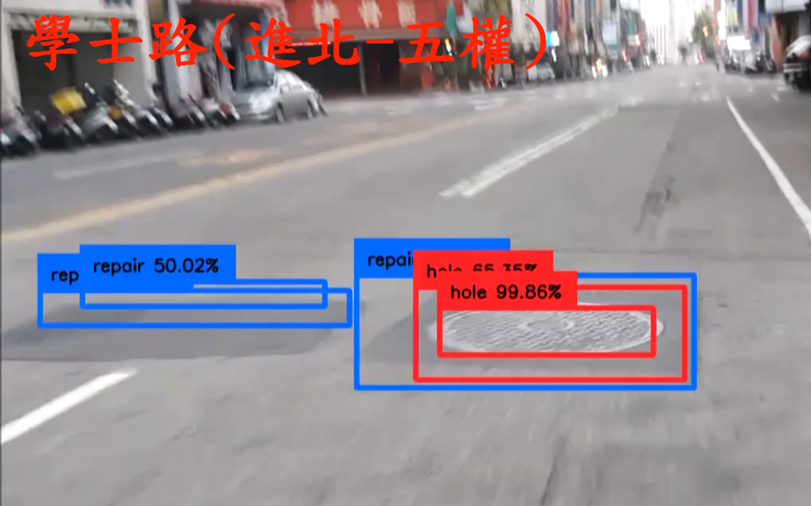
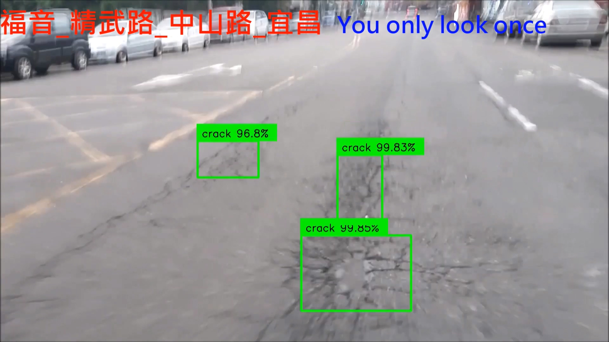
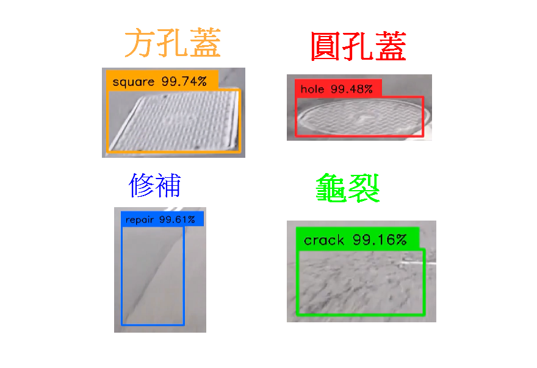

## 道路不平，導致車禍案例:     
+  研發替代役的碩士畢業生，補丁不平而摔車，慘遭一旁的大貨車輾爆頭當場慘死:  
         https://blog.xuite.net/seeder999/blog/393133787-%E5%9C%8B%E5%AE%B6%E8%B3%A0%E5%84%9F--%E9%81%93%E8%B7%AF%E6%96%BD%E5%B7%A5%E5%BE%8C%E8%A3%9C%E4%B8%81%E4%B8%8D%E5%B9%B3  
+  兒車禍喪命 父填平孟買坑洞路
         http://merit-times.com/NewsPage.aspx?Unid=520935
+  基隆人的怒吼！路平連署　車禍截肢女哭求政府還公道
         https://www.ettoday.net/news/20120408/37682.htm
+  2018年(跟下一則情況很像) 路肩超車壓5公分凸起摔！碩二女慘被遊覽車輾頭亡　家屬擬告國賠
         https://www.ettoday.net/news/20181206/1323800.htm
+  [東森新聞HD]2014年 廚師摔車遭輾斃 父：路不平害死兒 
         https://www.youtube.com/watch?v=PtkQ-uGyJIs


## Youtube
+  台灣大道(五權-河南) [[影片]](https://www.youtube.com/watch?v=dGdSBJNrWFo)
+  頻道 : https://www.youtube.com/playlist?list=PLo1dI8UvQiZhsJXu1EAROgNium1kPCXSH

 

## classes
+  
## predict 圖片或影片
0. 執行: 
    +  0.1  開啟 holes_dection_3classes.ipynb，直接執行。輸出在 資料夾 output。測試圖片在 ./o_input/ 。 
    +  0.2  開啟 holes_dection_4classes.ipynb，直接執行。輸出在 資料夾 output。測試圖片在 ./o_input/ 。
    +  Android app下載點: https://drive.google.com/file/d/1NA7GmU9GAODy5MaIWsuX4YpUalU9OkR5/view?usp=sharing
1. 輸入檔案擺放位置:
     將要偵測的 影片或圖片 放到 資料夾 o_input (影片必須為mp4格式；圖片可以多張，必須為 '.jpg','.JPG','.png','JPEG' 格式)。
2. 程式設定: 

     (第17行) 假設 影片名稱為Produce.mp4，則 input_path   = './o_input/Produce.mp4'。
     
     (第17行) 假設 要偵測圖片(可以多張)，則 input_path   = './o_input/' 。
    
    以下有2個模型，分別偵測 4個類別、3個類別:
    +  2.1  model 為 kholes_608_ang_ne.h5:  
         +  下載點: https://drive.google.com/file/d/1ADuvdtIh4tG4baw7_KnDk8ieQ3I1kGHR/view?usp=sharing    
         +  下載後，至於專案根目錄。
         +  開啟 holes_dection_3classes.ipynb，直接執行。
         +  (偵測4種類別 "圓孔蓋"(紅色), "方孔蓋"(黃色), "修補"(藍色))  
         +  第34行 infer_model = load_model('kholes_608_ang_ne.h5') :     
    +  2.2  model 為 kholes_448_an_ne4.h5:
         +  下載點 https://drive.google.com/file/d/1wbhtz99RANQ2-EDhSCW3hKhsHSrHWXw3/view?usp=sharing 
         +  下載後，至於專案根目錄。
         +  開啟 holes_dection_4classes.ipynb，直接執行。
         +  (偵測3種類別 "圓孔蓋"(紅色), "方孔蓋"(黃色), "修補"(藍色), "龜裂"(綠色))  
         +  第34行 infer_model = load_model('kholes_448_an_ne4.h5') :    
3. 輸出結果:
     執行結束後，輸出會在 資料夾 output。6秒鐘的影片，大約需要9分鐘；一張圖片，約3秒鐘(在很普通的筆電)。
4. 資料蒐集:
     使用 A8+ 手機。
5. 測試環境:
     windows。
6. 取消utils/bbox.py的所有註解，會輸出bounding box的座標與 類別(["hole", "square", "repair", "crack"] #   ["圓孔蓋", "方孔蓋", "修補","龜裂"])。

## Todo list:
- [x] 製作手機App。
- [ ] 依據出現的bounding boxes數目，建立評比分數。

# YOLO3 (Detection, Training, and Evaluation) 以下為原作者

## Dataset and Model

Dataset | mAP | Demo | Config | Model
:---:|:---:|:---:|:---:|:---:
Kangaroo Detection (1 class) (https://github.com/experiencor/kangaroo) | 95% | https://youtu.be/URO3UDHvoLY | check zoo | http://bit.do/ekQFj
Raccoon Detection (1 class) (https://github.com/experiencor/raccoon_dataset) | 98% | https://youtu.be/lxLyLIL7OsU | check zoo | http://bit.do/ekQFf
Red Blood Cell Detection (3 classes) (https://github.com/experiencor/BCCD_Dataset) | 84% | https://imgur.com/a/uJl2lRI | check zoo | http://bit.do/ekQFc
VOC (20 classes) (http://host.robots.ox.ac.uk/pascal/VOC/voc2012/) | 72% | https://youtu.be/0RmOI6hcfBI | check zoo | http://bit.do/ekQE5

## Todo list:
- [x] Yolo3 detection
- [x] Yolo3 training (warmup and multi-scale)
- [x] mAP Evaluation
- [x] Multi-GPU training
- [x] Evaluation on VOC
- [ ] Evaluation on COCO
- [ ] MobileNet, DenseNet, ResNet, and VGG backends

## Detection

Grab the pretrained weights of yolo3 from https://pjreddie.com/media/files/yolov3.weights.

```python yolo3_one_file_to_detect_them_all.py -w yolo3.weights -i dog.jpg``` 

## Training

### 1. Data preparation 

Download the Raccoon dataset from from https://github.com/experiencor/raccoon_dataset.

Organize the dataset into 4 folders:

+ train_image_folder <= the folder that contains the train images.

+ train_annot_folder <= the folder that contains the train annotations in VOC format.

+ valid_image_folder <= the folder that contains the validation images.

+ valid_annot_folder <= the folder that contains the validation annotations in VOC format.
    
There is a one-to-one correspondence by file name between images and annotations. If the validation set is empty, the training set will be automatically splitted into the training set and validation set using the ratio of 0.8.

### 2. Edit the configuration file
The configuration file is a json file, which looks like this:

```python
{
    "model" : {
        "min_input_size":       352,
        "max_input_size":       448,
        "anchors":              [10,13,  16,30,  33,23,  30,61,  62,45,  59,119,  116,90,  156,198,  373,326],
        "labels":               ["raccoon"]
    },

    "train": {
        "train_image_folder":   "/home/andy/data/raccoon_dataset/images/",
        "train_annot_folder":   "/home/andy/data/raccoon_dataset/anns/",      
          
        "train_times":          10,             # the number of time to cycle through the training set, useful for small datasets
        "pretrained_weights":   "",             # specify the path of the pretrained weights, but it's fine to start from scratch
        "batch_size":           16,             # the number of images to read in each batch
        "learning_rate":        1e-4,           # the base learning rate of the default Adam rate scheduler
        "nb_epoch":             50,             # number of epoches
        "warmup_epochs":        3,              # the number of initial epochs during which the sizes of the 5 boxes in each cell is forced to match the sizes of the 5 anchors, this trick seems to improve precision emperically
        "ignore_thresh":        0.5,
        "gpus":                 "0,1",

        "saved_weights_name":   "raccoon.h5",
        "debug":                true            # turn on/off the line that prints current confidence, position, size, class losses and recall
    },

    "valid": {
        "valid_image_folder":   "",
        "valid_annot_folder":   "",

        "valid_times":          1
    }
}

```

The ```labels``` setting lists the labels to be trained on. Only images, which has labels being listed, are fed to the network. The rest images are simply ignored. By this way, a Dog Detector can easily be trained using VOC or COCO dataset by setting ```labels``` to ```['dog']```.

Download pretrained weights for backend at:

https://1drv.ms/u/s!ApLdDEW3ut5fgQXa7GzSlG-mdza6

**This weights must be put in the root folder of the repository. They are the pretrained weights for the backend only and will be loaded during model creation. The code does not work without this weights.**

### 3. Generate anchors for your dataset (optional)

`python gen_anchors.py -c config.json`

Copy the generated anchors printed on the terminal to the ```anchors``` setting in ```config.json```.

### 4. Start the training process

`python train.py -c config.json`

By the end of this process, the code will write the weights of the best model to file best_weights.h5 (or whatever name specified in the setting "saved_weights_name" in the config.json file). The training process stops when the loss on the validation set is not improved in 3 consecutive epoches.

### 5. Perform detection using trained weights on image, set of images, video, or webcam
`python predict.py -c config.json -i /path/to/image/or/video`

It carries out detection on the image and write the image with detected bounding boxes to the same folder.

## Evaluation

`python evaluate.py -c config.json`

Compute the mAP performance of the model defined in `saved_weights_name` on the validation dataset defined in `valid_image_folder` and `valid_annot_folder`.
